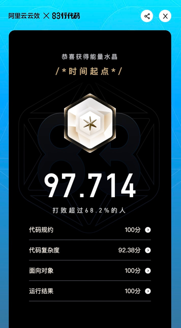

恭喜你来到第三关「重塑人生」！

你的任务：
找到埋藏的bug；控制中枢的重启需要你帮助完成贸易站的系统升级，让我们可以添加新的商品，以保证在灾害结束前供应给需要的人们。

简单介绍一下我们的系统：
* 商品（Item）都有一个销售剩余天数（SellIn），表示该商品必须在该值所代表的天数内销售出去。
* 所有商品都有一个Value值，代表商品的价值。
* 每过一天，所有商品的SellIn值和Value值都减1。
* 一旦过了销售剩余天数，价值就以双倍的速度下滑。
* 陈年老酒（Aged Wine）是一种特殊的商品，放得越久，价值反而越高。而且过了销售剩余天数后价值会双倍上涨。
* 商品的价值永远不会小于0，也永远不会超过50。
* 魔法锤（Sulfuras）是一种传奇商品，其销售剩余天数和品质值都不会变化。
* 演出票（Show Ticket）越接近演出日，价值反而上升。在演出前10天，价值每天上升2点；演出前5天，价值每天上升3点。但一旦过了演出日，价值就马上变成0。
* 最近因为灾害，我们采购了特效药（Cure）， 特效药的贬值速度是普通物品的两倍，这更加需要尽快升级我们的系统。


### 注意：
1. 后台会运行若干单测来验证程序的正确性，请不要修改提示了不允许修改的类或者方法的签名，以保证测试的正常运行。例如以下提示：     
   // Please don't modify the signature of this method.   
   // Please don't modify the class name.

2. 如果程序存在编译错误，各项得分将直接判定为0分。


---
假设 Aged Wine初始值为 sellin=5 value=10
初始值为第1天:5 - 10
第2天:4 - 11
第3天:3 - 12
第4天:2 - 13
第5天:1 - 14
第6天:0 - 16
第7天:-1 - 18
直到value=50后不在变化

是这样的计算过程吗？


1. 以-1作为突变点
2. 不对ticket做特殊处理. 
50分


1. 以-1作为突变点
   1. [x, 0] 对应 value都 -1
   2. [-1, -x] 对应value 都=0
2. 不对ticket做特殊处理.
   1. []
运行结果: 50分


``` 50分
this.sellIn--;
if (this.sellIn > 10) {
   this.value += 1;
} else if (this.sellIn > 5 && this.sellIn <= 10) {
   this.value += 2;
} else if (this.sellIn > 0 && this.sellIn <= 5) {
   this.value += 3;
} else if (this.sellIn <= 0) {
   this.value = 0;
}
formatValue();
```


``` ?? 分?
this.sellIn--;
if (this.sellIn >= 10) {
   this.value += 1;
} else if (this.sellIn >= 5 && this.sellIn < 10) {
   this.value += 2;
} else if (this.sellIn >= 0 && this.sellIn < 5) {
   this.value += 3;
} else if (this.sellIn < 0) {
   this.value = 0;
}
formatValue();

> 仍然是50分
```


```
初始化时, 不formatValue呢? 
> 仍然是50分
```


``` 
ShowTicket初始化时, 如果sellIn < 0, 则把初始价值修改为0
Item初始化时, 进行formatValue, 强制<0的value, 将value置为0
> 仍然是50分
```

update 20211112: 
```
看了赛题解析, 终于知道问题出在哪里了!!
根本不是代码逻辑问题, 而是因为结果的评测, 不是按照打印出来的数据进行的.
而是根据传入的item对象, 评测完成之后.
所以不能修改传入的Item对象!!!! 
即不能new Sulfuras(Item i), 然后把sulfras.xxx = i.xxx 这种!!!
这个真是个大BUG!!! 题目也不说清楚.
```


